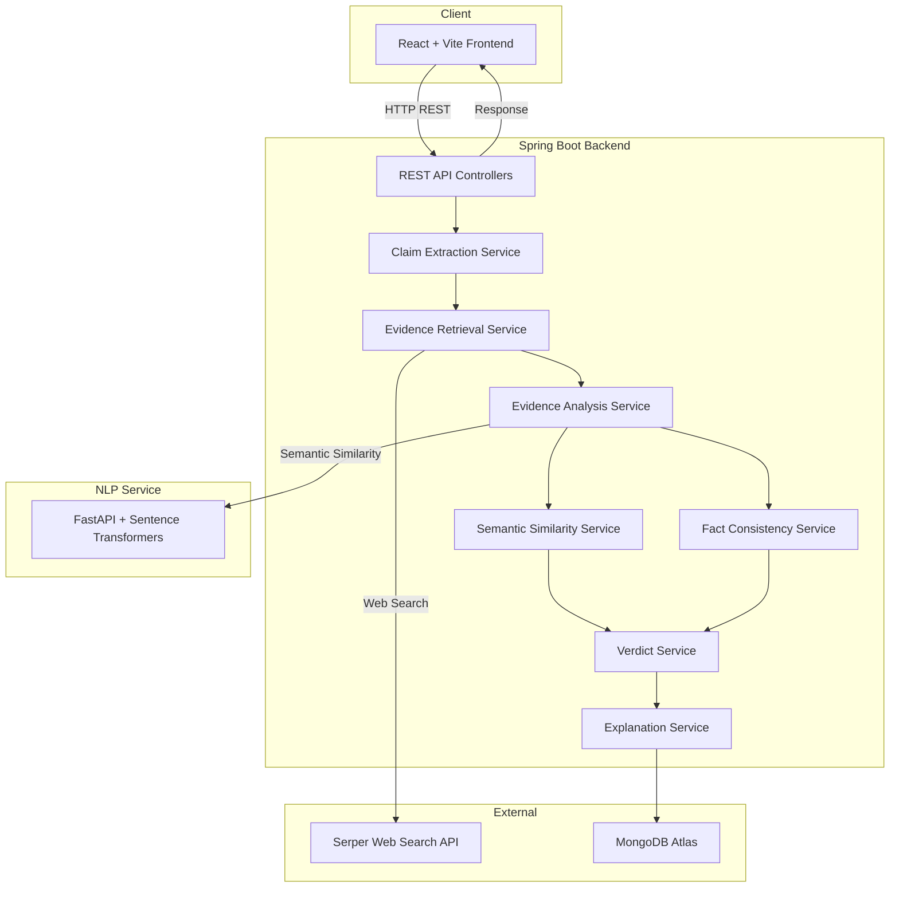

# TruthLens

**Evidence-Based News Verification System**

TruthLens is a full-stack news verification platform that evaluates the truthfulness of claims using web evidence, NLP semantic similarity, and multi-signal analysis. It extracts individual claims from user-submitted text, retrieves real-time evidence from the web, scores source reliability, computes semantic similarity using Sentence Transformers, and produces an explainable, evidence-backed verdict for each claim.

---

## Demo

| | Link |
|---|---|
| **Live Demo** | [truthlens-frontend-nuf4.onrender.com](https://truthlens-frontend-nuf4.onrender.com) |
| **GitHub** | [github.com/aayush19q/TruthLens](https://github.com/aayush19q/TruthLens) |

> **Note:** The live demo is hosted on Render's free tier. The backend and NLP services may take 30–60 seconds to wake up on the first request.

---

## Features

- **Claim Extraction** — Automatically splits user-submitted text into individual verifiable claims.
- **Web Evidence Retrieval** — Searches the web in real time via the Serper API to find relevant sources.
- **Source Reliability Scoring** — Evaluates the credibility of each evidence source based on domain reputation.
- **Semantic Similarity Analysis** — Uses Sentence Transformers (`all-MiniLM-L6-v2`) to measure how closely evidence supports or contradicts a claim.
- **TF-IDF / Concept Fallback** — Falls back to keyword and concept-based matching when the NLP service is unavailable.
- **Numerical & Temporal Consistency** — Cross-checks numerical values and temporal references between claims and evidence.
- **Per-Claim Verdicts** — Each claim receives an independent verdict: `TRUE`, `FALSE`, or `UNCERTAIN`.
- **Mixed Results** — When multiple claims produce conflicting verdicts, the system returns an overall `MIXED` result.
- **Evidence-Based Explanations** — Generates a human-readable explanation summarizing why the verdict was reached.
- **Verification History** — All results are persisted in MongoDB Atlas and viewable from the History page.
- **Responsive UI** — A clean, modern React interface with claim-by-claim breakdowns, confidence meters, and evidence cards.

---

## How It Works

```
User submits text
       │
       ▼
  React Frontend ──POST /api/verifications──▶ Spring Boot Backend
                                                     │
                                              Claim Extraction
                                                     │
                                         ┌───────────┴───────────┐
                                         ▼                       ▼
                                  Serper API              (per claim)
                              Evidence Retrieval                 │
                                         │                       │
                                         ▼                       │
                              Source Reliability                  │
                                   Scoring                       │
                                         │                       │
                                         ▼                       │
                              NLP Semantic Similarity             │
                            (Sentence Transformers)              │
                                         │                       │
                                         ▼                       │
                              Numerical / Temporal               │
                              Consistency Checks                 │
                                         │                       │
                                         ▼                       ▼
                                  Verdict Engine ◀───────────────┘
                                         │
                                         ▼
                              Explanation Generator
                                         │
                                         ▼
                                  MongoDB Atlas
                                  (persistence)
                                         │
                                         ▼
                              Response to Frontend
```

1. The user pastes a news claim or article into the React frontend.
2. The frontend sends a `POST` request to the Spring Boot backend.
3. The backend extracts individual verifiable claims from the text.
4. For each claim, the Serper API retrieves relevant web search results.
5. Each evidence source is scored for domain reliability.
6. The NLP service computes semantic similarity between the claim and each piece of evidence using Sentence Transformers. If the NLP service is unavailable, the backend falls back to TF-IDF / concept-based matching.
7. Numerical values and temporal references are cross-checked for consistency.
8. The verdict engine aggregates all signals to produce a per-claim verdict (`TRUE`, `FALSE`, or `UNCERTAIN`) and an overall result (which may be `MIXED`).
9. An evidence-based explanation is generated summarizing the reasoning.
10. The full verification result is saved to MongoDB Atlas and returned to the frontend.

---

## System Architecture



---

## NLP / AI Approach

TruthLens uses a multi-signal evidence analysis pipeline rather than a single classification model. No custom fake-news classifier is trained — the system relies entirely on real-time evidence retrieval and comparison.

### Semantic Similarity

The dedicated NLP microservice loads the **Sentence Transformers** model [`all-MiniLM-L6-v2`](https://huggingface.co/sentence-transformers/all-MiniLM-L6-v2), a lightweight transformer trained on over 1 billion sentence pairs. For each claim–evidence pair, the service:

1. Encodes both texts into 384-dimensional normalized embeddings.
2. Computes cosine similarity via dot product.
3. Returns a similarity score in the range `[0.0, 1.0]`.

### TF-IDF / Concept Fallback

When the NLP service is unavailable, the backend falls back to a built-in TF-IDF and concept-based matching approach. This extracts key terms and computes overlap-based similarity, ensuring the system remains functional even without the transformer model.

### Numerical Consistency

The system extracts numerical values (percentages, monetary amounts, counts) from both claims and evidence, then checks whether the numbers are consistent, partially matching, or contradictory.

### Temporal Consistency

Date and time references are extracted and compared to detect temporal mismatches between claims and supporting evidence.

### Source Reliability

Each evidence source receives a reliability score based on its domain. Established, well-known news organizations and institutional sources receive higher reliability scores than unknown or low-quality domains.

### Evidence Relationship Classification

Each piece of evidence is classified as `SUPPORTS`, `CONTRADICTS`, or `UNCLEAR` based on the combined semantic similarity, numerical consistency, and temporal consistency signals.

---

## Verdict Logic

Each individual claim receives a verdict based on the aggregated evidence:

| Verdict | Meaning |
|---|---|
| **TRUE** | The majority of reliable evidence supports the claim. |
| **FALSE** | The majority of reliable evidence contradicts the claim. |
| **UNCERTAIN** | Insufficient or conflicting evidence to make a determination. |

When multiple claims are analyzed together, the overall verification status is determined by combining individual verdicts:

| Overall Status | Condition |
|---|---|
| **TRUE** | All claims are `TRUE`. |
| **FALSE** | All claims are `FALSE`. |
| **MIXED** | Claims have different verdicts (e.g., one `TRUE` and one `FALSE`). |
| **UNCERTAIN** | All claims are `UNCERTAIN`, or evidence is insufficient. |

A confidence score (0–100%) is computed from the strength and consistency of the evidence.

---

## Tech Stack

| Layer | Technology |
|---|---|
| **Frontend** | React 19, Vite, Lucide Icons |
| **Backend** | Java 21, Spring Boot 3, Spring Data MongoDB |
| **NLP Service** | Python, FastAPI, Sentence Transformers, PyTorch |
| **Database** | MongoDB Atlas |
| **Evidence API** | Serper (Google Search API) |
| **Containerization** | Docker, Docker Compose |
| **Deployment** | Render |

---

## Project Structure

```
TruthLens/
├── backend/                  # Spring Boot backend API
│   ├── src/
│   │   ├── main/java/        # Controllers, services, models, DTOs
│   │   └── test/java/        # Unit and integration tests
│   ├── Dockerfile
│   └── pom.xml
├── frontend/                 # React + Vite frontend
│   ├── src/
│   ├── Dockerfile
│   ├── docker-entrypoint.sh  # Dynamic nginx config generation
│   └── package.json
├── nlp-service/              # Python FastAPI NLP microservice
│   ├── app.py
│   ├── Dockerfile
│   └── requirements.txt
├── docs/                     # Architecture documentation
├── docker-compose.yml        # Full-stack local orchestration
├── .env.example              # Environment variable template
├── .gitignore
└── README.md
```

| Directory | Purpose |
|---|---|
| `backend/` | Java Spring Boot REST API — claim extraction, evidence retrieval, analysis, verdict engine, and persistence. |
| `frontend/` | React SPA — input form, verification results display, claim-by-claim breakdown, and history page. |
| `nlp-service/` | Standalone Python microservice that computes semantic similarity using Sentence Transformers. |
| `docs/` | Architecture diagrams and technical documentation. |

---

## API Endpoints

### Verification

| Method | Endpoint | Description |
|---|---|---|
| `POST` | `/api/verifications` | Submit text for verification. Extracts claims, retrieves evidence, and returns the full result. |
| `GET` | `/api/verifications` | List all past verification results. |
| `GET` | `/api/verifications/{id}` | Retrieve a specific verification by ID. |

#### POST /api/verifications

**Request:**

```json
{
  "originalText": "India's GDP growth was 8.2% in 2024."
}
```

**Response (201 Created):**

```json
{
  "id": "665a...",
  "originalText": "India's GDP growth was 8.2% in 2024.",
  "status": "TRUE",
  "confidence": 0.82,
  "explanation": "The claim is supported by multiple reliable sources...",
  "claims": [
    {
      "id": "claim-1",
      "text": "India's GDP growth was 8.2% in 2024",
      "verdict": "TRUE",
      "confidence": 0.82,
      "evidence": [
        {
          "title": "India GDP Growth Rate",
          "url": "https://example.com/...",
          "sourceName": "example.com",
          "content": "India recorded GDP growth of 8.2%...",
          "similarityScore": 0.89,
          "reliabilityScore": 0.85,
          "numericalStrength": 1.0,
          "relationship": "SUPPORTS"
        }
      ]
    }
  ],
  "createdAt": "2025-09-15T12:00:00"
}
```

### Evidence Search

| Method | Endpoint | Description |
|---|---|---|
| `GET` | `/api/evidence/search?claim=...` | Search and analyze evidence for a single claim. |

### Single Claim Verification

| Method | Endpoint | Description |
|---|---|---|
| `GET` | `/api/verify?claim=...` | Verify a single claim and return the verdict, confidence, and evidence. |

### Health Check

| Method | Endpoint | Description |
|---|---|---|
| `GET` | `/health` | Backend health status. |
| `GET` | `/api/health` | Backend health status (alternate path). |

### NLP Service

| Method | Endpoint | Description |
|---|---|---|
| `GET` | `/health` | NLP service health status and model info. |
| `POST` | `/similarity` | Compute semantic similarity between two texts. |

---

## Local Setup

### Prerequisites

- Java 21+
- Node.js 20+
- Python 3.10+
- MongoDB (local or Atlas)
- Docker and Docker Compose (optional, for containerized setup)

### 1. Clone the Repository

```bash
git clone https://github.com/aayush19q/TruthLens.git
cd TruthLens
```

### 2. Configure Environment Variables

```bash
cp .env.example .env
```

Edit `.env` and fill in your values:

```env
SERPER_API_KEY=your_serper_api_key_here
MONGODB_URI=mongodb://localhost:27017/truthlens
NLP_SERVICE_URL=http://127.0.0.1:8000/similarity
PORT=8080
CORS_ALLOWED_ORIGINS=http://localhost:5173,http://127.0.0.1:5173
```

> **Important:** Never commit your `.env` file. It is listed in `.gitignore`.

### 3. Start the NLP Service

```bash
cd nlp-service
pip install -r requirements.txt
python app.py
```

The NLP service starts on `http://localhost:8000`. The Sentence Transformer model will be downloaded automatically on first run (~80 MB).

### 4. Start the Backend

```bash
cd backend
./mvnw spring-boot:run
```

The backend starts on `http://localhost:8080`.

### 5. Start the Frontend

```bash
cd frontend
npm install
npm run dev
```

The frontend starts on `http://localhost:5173`.

### Docker Compose (Full Stack)

To run all services together:

```bash
cp .env.example .env
# Edit .env with your SERPER_API_KEY

docker compose up --build
```

| Service | URL |
|---|---|
| Frontend | http://localhost:8088 |
| Backend | http://localhost:8080 (internal) |
| NLP Service | http://localhost:8000 (internal) |
| MongoDB | localhost:27017 |

---

## Deployment

TruthLens is deployed on **Render** as three independent services:

| Service | Platform | Details |
|---|---|---|
| **Frontend** | Render (Static / Web Service) | React SPA served via nginx. Uses `VITE_API_BASE_URL` to connect to the backend. |
| **Backend** | Render (Web Service) | Spring Boot JAR. Connects to MongoDB Atlas and the NLP service. |
| **NLP Service** | Render (Web Service) | FastAPI with Sentence Transformers. Stateless, no external dependencies. |
| **Database** | MongoDB Atlas | Managed cloud MongoDB cluster. |

### Environment Variables (Render)

**Backend:**
- `MONGODB_URI` — MongoDB Atlas connection string
- `SERPER_API_KEY` — Serper API key
- `NLP_SERVICE_URL` — URL of the deployed NLP service
- `CORS_ALLOWED_ORIGINS` — Frontend URL
- `PORT` — Assigned by Render

**Frontend:**
- `VITE_API_BASE_URL` — Full URL of the deployed backend (build-time arg)

**NLP Service:**
- `HOST=0.0.0.0`
- `PORT` — Assigned by Render

### Nginx Dual-Mode Configuration

The frontend Docker image uses a dynamic entrypoint script (`docker-entrypoint.sh`) that generates the nginx configuration at startup:

- **Docker Compose:** `BACKEND_URL=http://backend:8080` is set, so nginx proxies `/api/*` requests to the backend container.
- **Render:** `BACKEND_URL` is not set, so no proxy block is generated. The React app calls the backend directly via `VITE_API_BASE_URL`.

---

## Testing

The backend includes unit and integration tests for core services and controllers:

```
backend/src/test/java/truthlens_backend/
├── BackendApplicationTests.java
├── controller/
│   └── VerificationControllerTests.java
└── service/
    ├── EvidenceAnalysisServiceTests.java
    ├── ExplanationServiceTests.java
    └── VerificationServiceTests.java
```

Run the tests:

```bash
cd backend
./mvnw test
```

---

## Screenshots

> Screenshots will be added here.

<!-- 
Add screenshots of:
- Verification input page
- TRUE verdict result
- FALSE verdict result  
- MIXED verdict result
- Claim-by-claim analysis with evidence
- Verification history page
-->

---

## Future Improvements

- **Improved Claim Extraction** — Use LLM-based extraction for better handling of complex and compound sentences.
- **Stronger Temporal Reasoning** — Detect outdated claims and time-sensitive assertions more accurately.
- **Enhanced Evidence Ranking** — Weight evidence by recency, source authority, and content depth.
- **Caching** — Cache frequent queries and evidence lookups to reduce API calls and improve response time.
- **User Authentication** — Add login and per-user verification history.
- **Monitoring & Observability** — Integrate structured logging, health dashboards, and alerting.
- **Batch Verification** — Support bulk submission of multiple claims or articles.
- **Multilingual Support** — Extend NLP capabilities to support non-English claims and evidence.

---

## Disclaimer

TruthLens is a prototype and research project built to demonstrate evidence-based news verification using NLP techniques. It is **not** an authoritative fact-checking service and should not be treated as one. Verdicts are generated algorithmically based on available web evidence and may be inaccurate, incomplete, or outdated. Always consult trusted, authoritative sources for critical information.

---

## License

This project is for educational and research purposes.
