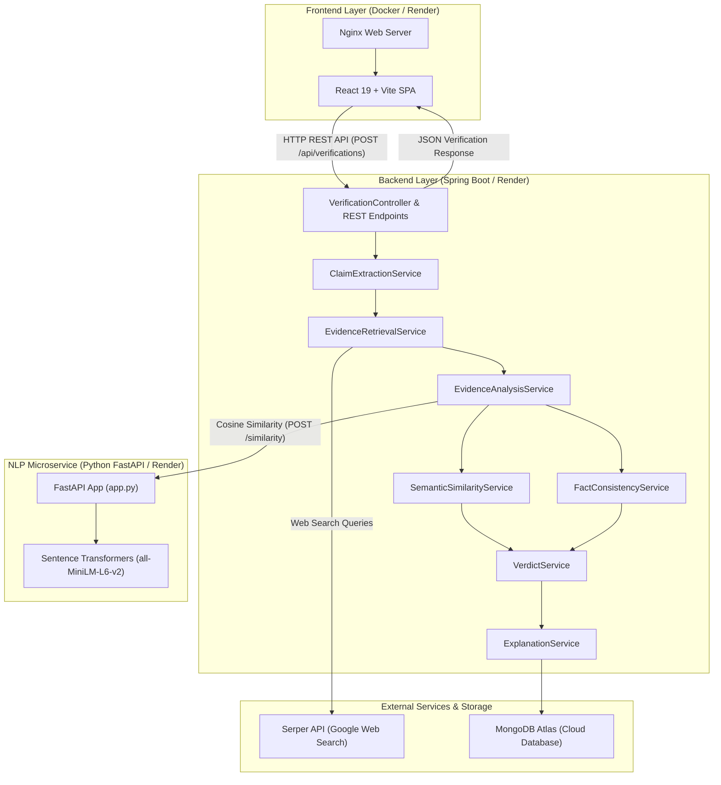

# TruthLens Architecture & Verification Pipeline Documentation

TruthLens is an evidence-based news verification platform built using a multi-service architecture comprising a React frontend, a Java Spring Boot backend API, a Python FastAPI NLP microservice, MongoDB Atlas database, and external web evidence retrieval via the Serper API.

---

## 1. High-Level System Architecture

---

## 2. Service Components & Deployment Models

### 2.1 React + Vite Frontend (`frontend/`)
- **Technology**: React 19, Vite, Lucide Icons.
- **Container / Web Server**: Nginx web server inside a Docker container using a dynamic startup script (`docker-entrypoint.sh`).
- **Dual-Mode API Configuration**:
  - **Local Docker Compose**: Nginx dynamically generates a reverse proxy block (`/api/*` -> `http://backend:8080/api/`).
  - **Render Cloud Deployment**: React application connects directly to the backend via `VITE_API_BASE_URL` (`https://truthlens-backend-2pbv.onrender.com`).

### 2.2 Spring Boot Backend API (`backend/`)
- **Technology**: Java 17, Spring Boot 4.1.1, Spring Data MongoDB, Embedded Tomcat.
- **Role**: Core orchestration engine managing claim extraction, evidence retrieval, multi-signal analysis, verdict calculation, explanation generation, and persistence.
- **Deployment**: Deployed as an independent Render Web Service listening on `${PORT:8080}`.

### 2.3 Python FastAPI NLP Microservice (`nlp-service/`)
- **Technology**: Python 3.10+, FastAPI, Uvicorn, PyTorch, Sentence Transformers.
- **Model**: `sentence-transformers/all-MiniLM-L6-v2` (384-dimensional dense sentence embeddings).
- **Endpoints**:
  - `GET /health` — Service health check and model loading state.
  - `POST /similarity` — Computes cosine similarity between sentence embeddings.
- **Deployment**: Deployed as a standalone Render Web Service listening on `0.0.0.0:${PORT}`.

### 2.4 External Data & Storage Layer
- **Serper API**: Real-time Google Web Search API used to retrieve organic search snippets and source URLs for extracted claims.
- **MongoDB Atlas**: Managed cloud database cluster storing full verification history in the `verifications` collection.

---

## 3. End-to-End Verification Pipeline Data Flow

1. **Submission & Ingestion**:
   The user submits news text or claims via the React frontend, sending a `POST` request to `/api/verifications` on the Spring Boot backend.

2. **Claim Extraction (`ClaimExtractionService`)**:
   Splits input text into discrete, verifiable claim statements using sentence demarcation regex.

3. **Web Evidence Retrieval (`EvidenceRetrievalService`)**:
   Constructs targeted search queries for each claim and queries the Serper API to retrieve relevant organic web search snippets and source URLs.

4. **Semantic Similarity Analysis (`SemanticSimilarityService`)**:
   - Sends claim-evidence text pairs to the Python FastAPI NLP microservice (`POST /similarity`).
   - The NLP service computes dense sentence embeddings using `all-MiniLM-L6-v2` and calculates normalized cosine similarity scores in the range `[0.0, 1.0]`.
   - **Fallback Mechanism**: If the NLP service is unavailable, the backend falls back to an internal TF-IDF / concept-matching algorithm to maintain system availability.

5. **Numerical & Temporal Consistency (`FactConsistencyService`)**:
   - Extracts numbers, percentages, monetary values, dates, and years from claims and evidence.
   - Cross-checks for numerical contradictions or temporal mismatches between claim assertions and evidence text.

6. **Source Reliability & Relationship Classification (`EvidenceAnalysisService`)**:
   - Assigns source reliability scores based on domain authority (government portals, reputable news agencies, fact-checkers vs. unverified domains).
   - Classifies evidence relationships into `SUPPORTS`, `CONTRADICTS`, or `UNCLEAR` based on semantic similarity, numerical, and temporal signals.

7. **Per-Claim Verdict Computation (`VerdictService`)**:
   Aggregates evidence classifications and source reliability scores to assign an individual verdict (`TRUE`, `FALSE`, or `UNCERTAIN`) and confidence score to each claim.

8. **Overall Verdict Aggregation (`VerificationService`)**:
   Combines individual claim verdicts into an overall verification status:
   - `TRUE`: All claims are verified `TRUE`.
   - `FALSE`: All claims are verified `FALSE`.
   - `MIXED`: Claims yield conflicting verdicts (e.g., one `TRUE` and one `FALSE`).
   - `UNCERTAIN`: Claims are inconclusive or evidence is insufficient.

9. **Explainable Reasoning (`ExplanationService`)**:
   Generates a clear narrative explanation summarizing the logical reasoning behind the overall verdict and claim evaluations.

10. **Persistence & History (`VerificationController` / MongoDB Atlas)**:
    Stores the full verification object in MongoDB Atlas and returns the result to the frontend. Past verifications are retrievable via `GET /api/verifications` and `GET /api/verifications/{id}`.

---

## 4. Containerization & Deployment Architecture

- **Local Development (`docker-compose.yml`)**: Orchestrates four local containers (`frontend`, `backend`, `nlp-service`, `mongodb`).
- **Cloud Deployment (Render)**:
  - Frontend, backend, and NLP services are deployed as independent, decoupled Docker services on Render.
  - Database persistence is provided by a MongoDB Atlas cloud cluster.
